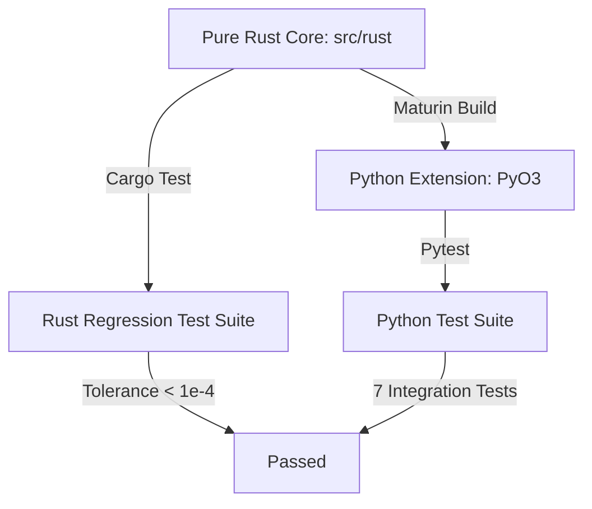

# Fortran to Rust Porting Documentation

This document outlines the software engineering process used to eliminate legacy Fortran build and compiler dependencies and deliver a pure Rust implementation of the International Reference Ionosphere 2020 (IRI2020) model.

---

## 1. Porting Strategy and Phased Milestones

### Phase 1: Incremental FFI and Equivalence Testing
To guarantee absolute numerical precision throughout the porting process, the initial architecture utilized a hybrid approach:

- Exposing Fortran routines via an FFI bridge layer (`iri_c_bindings.f90`).
- Statically linking the Fortran library into the Rust package using `build.rs` and compilation crates (`cc`, `cmake`).
- Constructing side-by-side integration tests (e.g., `igrf_tests.rs`, `cira_tests.rs`) to verify every translated Rust routine against the active Fortran reference.

### Phase 2: Core Algorithm Translations
Individual modules were translated to safe Rust and tested incrementally:

- **IGRF**: Refactored in `igrf.rs` to eliminate global mutable common blocks, encapsulating state inside a thread-safe `IgrfModel` struct.
- **CIRA**: Refactored in `cira.rs`. Resolved implicit state bugs where thermospheric profiles stored temperatures across independent evaluations via legacy Fortran `SAVE` statements.
- **ROCSAT-1**: Refactored in `rocdrift.rs`, correcting a critical Fortran bug where geographic longitude was left uninitialized in the interpolation routine.
- **Coordinate Tracing & Integration**: Translated the coordinate converter `iriflip.rs` and Total Electron Content integrator `iritec.rs`.

### Phase 3: Pure Rust Transition
After verifying all auxiliary subroutines, we completed the final translation:

- **FFI Removal**: Deleted all FFI wrappers, bindings, and the `build.rs` compile configuration.
- **Refactoring Main Execution Loop**: Replaced remaining FFI targets in `irisub.rs` with Rust stubs and utility methods, removing the `use crate::ffi::*;` dependency block.
- **Cleanup**: Purged the FFI-dependent test suites, leaving only pure Rust unit and integration tests.

## 2. Key Bug Fixes and Numerical Corrections

During translation, several hidden bugs and inconsistencies in the original Fortran codebase were identified and resolved:

| Component / File | Original Fortran Bug / Issue | Rust Implementation Solution |
| :--- | :--- | :--- |
| **CIRA Atmospheric Model** (`cira.rs`) | High altitude temperature values ($T[1]$) were affected by state pollution across calls due to implicit retention (`SAVE` variables). | Stateless initialization: $T[1]$ is computed from the thermospheric profile explicitly at the start of the `gts7` routine. |
| **ROCSAT-1 Drift Model** (`rocdrift.rs`) | Geographic longitude variable `xgglon` was evaluated without ever being initialized, causing drift computations to run on stack garbage. | Geographic longitude is explicitly assigned and parsed into the interpolation routines. |
| **Ap MSIS Solar Index** (`data_io.rs`) | Unsigned integer subtraction of `usize` indices triggered panic underflows when calculating hours and dates. | Arguments cast to signed integer formats ($i32$) prior to index computations to prevent underflows. |

## 3. Build & Test Architecture

### Verification Flow

- **PyO3 Bindings**: The Rust crate exposes mathematical models to Python via Maturin, generating zero-overhead Python bindings.
- **Rust Regression Tests**: Configured under `regression_tests.rs`, validating outputs against the three golden fixtures (`scenario1.json`, `scenario2.json`, `scenario3.json`) with a relative tolerance of $10^{-4}$.
- **Thread Safety**: All global common blocks (`/COMMON/`) have been removed, making the Rust library thread-safe and capable of executing profile computations in parallel.
