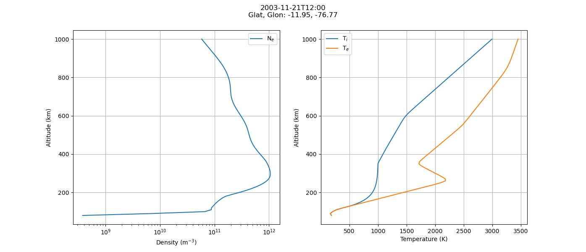
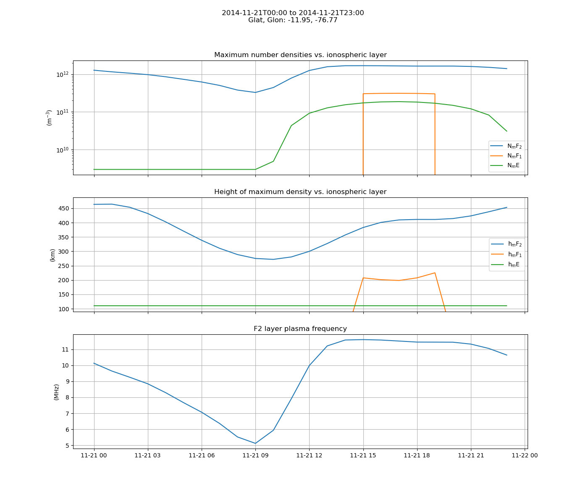
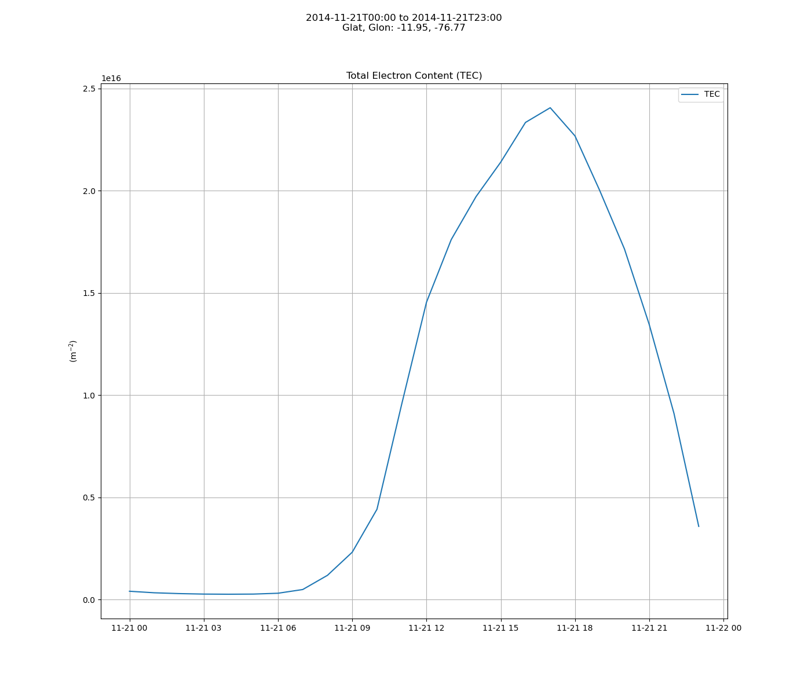
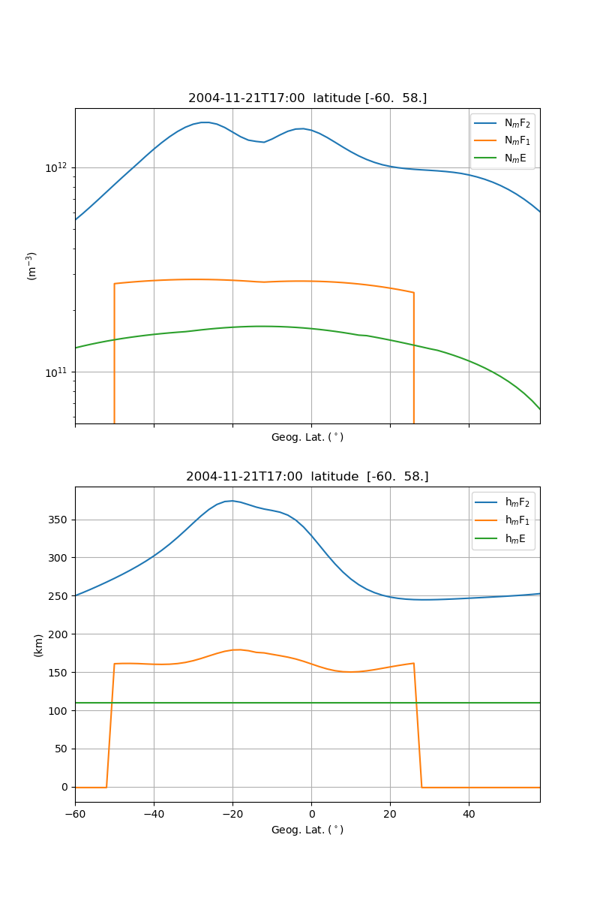

# Python package

This part of the documentation covers the Python interface to the IRI2020 model. The Python package wraps the high-performance pure Rust implementation using PyO3 and exposes it as clean, user-friendly Python APIs returning `xarray.Dataset` objects.

## Installation

You can install the package directly using standard Python package managers:

```bash
uv pip install .
```

This compiles the pure Rust core library and binds it into a Python extension module named `iri2020.iri2020`.

## Quick Start

The main interface is the `IRI` function, which calculates ionospheric parameters for a specific time, geographic coordinates, and altitude range.

```python
from datetime import datetime
import iri2020

# Calculate ionospheric parameters
dataset = iri2020.IRI(
    time=datetime(2020, 6, 21, 12, 0, 0),
    altkmrange=[100.0, 500.0, 10.0],  # Min altitude, Max altitude, Step size (km)
    glat=45.0,                         # Geographic latitude
    glon=-75.0                         # Geographic longitude
)

print(dataset)
```

## API Reference

### `IRI`

```python
def IRI(
    time: str | datetime,
    altkmrange: list[float],
    glat: float,
    glon: float
) -> xarray.Dataset
```

Calculates the ionospheric parameters for a single location and time across a range of altitudes.

- **Parameters**:
  - `time` (`str` or `datetime`): Universal Time (UT) for the calculation. If a string is provided, it is parsed automatically.
  - `altkmrange` (`list[float]`): A list of three floats specifying `[min_altitude, max_altitude, step_size]` in kilometers.
  - `glat` (`float`): Geographic latitude in degrees.
  - `glon` (`float`): Geographic longitude in degrees.
- **Returns**: An `xarray.Dataset` containing the computed parameters.

### `timeprofile`

```python
def timeprofile(
    tlim: tuple[datetime | str, datetime | str],
    dt: timedelta,
    altkmrange: list[float],
    glat: float,
    glon: float
) -> xarray.Dataset
```

Computes the altitude profile of the ionosphere over a specified time range for a fixed geographic location.

- **Parameters**:
  - `tlim` (`tuple`): A tuple of `(start_time, end_time)`.
  - `dt` (`timedelta`): Time step size.
  - `altkmrange` (`list[float]`): A list of three floats specifying `[min_altitude, max_altitude, step_size]` in kilometers.
  - `glat` (`float`): Geographic latitude in degrees.
  - `glon` (`float`): Geographic longitude in degrees.
- **Returns**: An `xarray.Dataset` concatenated along the `time` dimension.

### `geoprofile`

```python
def geoprofile(
    latrange: tuple[float, float, float],
    glon: float,
    altkm: float,
    time: str | datetime
) -> xarray.Dataset
```

Computes the altitude profile at a single time and single altitude over a geographic latitude range.

- **Parameters**:
  - `latrange` (`tuple`): A tuple of `(start_lat, end_lat, step_lat)`.
  - `glon` (`float`): Geographic longitude in degrees.
  - `altkm` (`float`): Altitude in kilometers.
  - `time` (`str` or `datetime`): Universal Time (UT) for the calculation.
- **Returns**: An `xarray.Dataset` concatenated along the `glat` dimension.

---

## Output Dataset Schema

The returned `xarray.Dataset` contains the following variables:

| Variable Name | Description | Units |
| :--- | :--- | :--- |
| `ne` | Electron density | $m^{-3}$ |
| `Tn` | Neutral temperature | K |
| `Ti` | Ion temperature | K |
| `Te` | Electron temperature | K |
| `nO+` | Relative $O^+$ abundance | % |
| `nH+` | Relative $H^+$ abundance | % |
| `nHe+` | Relative $He^+$ abundance | % |
| `nO2+` | Relative $O_2^+$ abundance | % |
| `nNO+` | Relative $NO^+$ abundance | % |
| `nCI` | Relative Cluster Ion abundance | % |
| `nN+` | Relative $N^+$ abundance | % |
| `NmF2` | Peak electron density of the F2 layer | $m^{-3}$ |
| `hmF2` | Height of the peak electron density of the F2 layer | km |
| `NmF1` | Peak electron density of the F1 layer | $m^{-3}$ |
| `hmF1` | Height of the peak electron density of the F1 layer | km |
| `NmE` | Peak electron density of the E layer | $m^{-3}$ |
| `hmE` | Height of the peak electron density of the E layer | km |
| `foF2` | F2-layer critical frequency | MHz |
| `TEC` | Vertical Total Electron Content | $m^{-2}$ |
| `EqVertIonDrift` | Equatorial vertical ion drift velocity | m/s |

### Attributes

- `f107`: Solar radio flux index ($F_{10.7}$) proxy value.
- `ap`: Geomagnetic planetary index ($A_p$) value.

---

## Visualization Examples

The package includes utility plotting functions under `iri2020.plots` to visualize the computed ionospheric results.

### Altitude Profile

Shows electron density ($N_e$) and temperatures ($T_i$, $T_e$) versus altitude:

```python
import iri2020
import iri2020.plots as plots
from matplotlib.pyplot import show

# Compute and plot altitude profile
res = iri2020.IRI("2020-06-21", [100.0, 500.0, 10.0], 45.0, -75.0)
plots.altprofile(res)
show()
```



### Time Profile

Plots F2/F1/E layer densities, heights, foF2 frequency, and vertical Total Electron Content (TEC) over time:

```python
from datetime import timedelta
import iri2020
import iri2020.plots as plots
from matplotlib.pyplot import show

# Compute and plot time profile
res = iri2020.timeprofile(
    tlim=("2020-06-21", "2020-06-22"),
    dt=timedelta(hours=1),
    altkmrange=[100.0, 500.0, 10.0],
    glat=45.0,
    glon=-75.0
)
plots.timeprofile(res)
show()
```




### Latitude Profile

Plots densities and heights over a range of geographic latitudes:

```python
import iri2020
import iri2020.plots as plots
from matplotlib.pyplot import show

# Compute and plot latitude profile
res = iri2020.geoprofile(latrange=(-60.0, 60.0, 2.0), glon=-75.0, altkm=300.0, time="2020-06-21")
plots.latprofile(res)
show()
```


